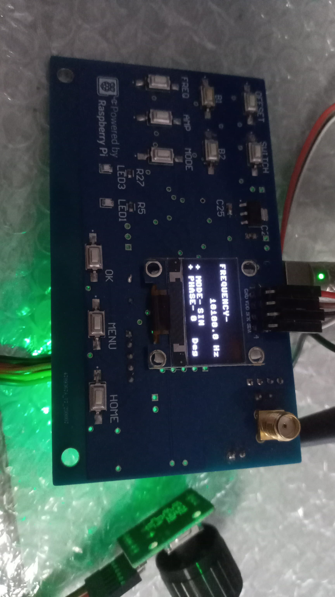
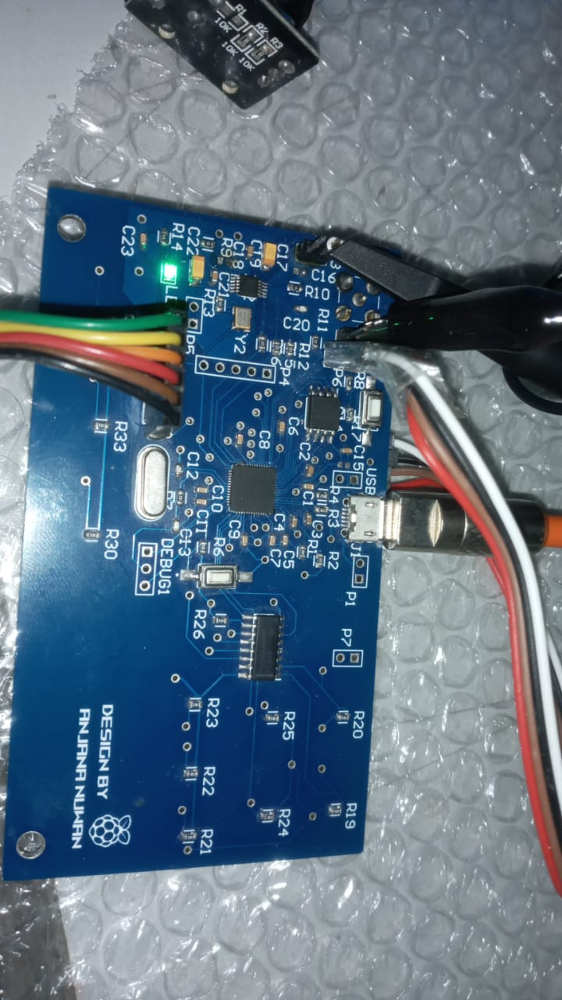

# Function Generator Powered by RP2040 and AD9833

This project features a **compact, handheld function generator** designed around the **RP2040 microcontroller** and the **AD9833 programmable waveform generator**. The generator is capable of producing **sine, triangle, and square waveforms** with a frequency range of **1 Hz to 2 MHz**, which has been thoroughly tested for accuracy and performance.

## Key Features:
- **Custom PCB Design**: Tailored to house the RP2040 and AD9833, ensuring efficient performance in a small, portable form factor.
- **OLED Display Interface**: Provides clear visualization of waveform type, frequency, and other settings.
- **Encoder and Button Panel**: Allows for intuitive control of frequency, waveform selection, and adjustments to settings.
- **High-Resolution Output**: Harnessing the **28-bit resolution** of the AD9833, ensuring precise and smooth waveform generation over a wide frequency range.
- **Firmware Development**: Custom firmware built for the RP2040 to manage waveform generation, user input, and real-time display updates.

  <figure>
    
    <figcaption><b>Function Generator Front</b></figcaption>
  </figure>
  
  <figure>
    
    <figcaption><b>Function Generator Back </b></figcaption>
  </figure>

</div

**Check Img Folder for Tested Waveforms**

## Applications:
This design is ideal for:
- **Laboratory environments** where precise signal generation is required.
- **Portable applications** due to its compact design and versatility.